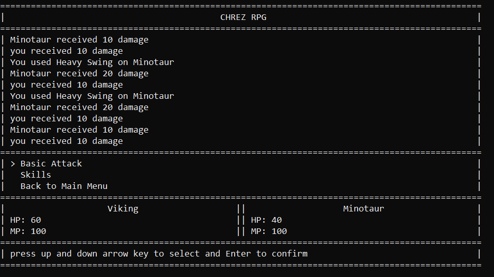

## Welcome to project Chrez RPG!

    

### requirements:
- You need to install [ruby](https://www.ruby-lang.org/en/downloads/) to play this game
- this game's designed for **windows** command-line, if you have other OS then... ¯\\_(ツ)_/¯ (can you tell me if it works?)

### How to run:
- run `bundle install` to download the required libraries
- run this game by executing `ruby ./main.rb` at the root folder